<picture>
  <source media="(max-width: 640px)" srcset="./assets/desktop-mobile.svg">
  
</picture>

<div align="center">

**Thierry Popat** · Software & Robotics · MEng, Manchester

</div>

<table width="100%">
<tr><td>

🔴 🟡 🟢 &nbsp;&nbsp; **`about-me.md`**

</td></tr>
<tr><td>

### It started with a very reasonable plan.

Watch Iron Man. Build my own JARVIS. Figure out the details along the way.

The first film got me into coding, and I've been at it for years. That curiosity took me into APIs, networks, Linux, and well beyond, learning things through experimentation and implementation.

I love making something go from **“I wonder if I could…”** to **“it actually works.”** The experimenting, the debugging, the tiny breakthroughs that turn into a very late night.

**I code for fun. For the challenge. For the “it actually works” moment.**

```python
class OriginStory:
    inspiration = "Iron Man"
    ambition = "Build my own JARVIS"
    motivation = "For the \"it actually works\" moment"

    def nextStep(self):
        return "Build something. Learn something. Go again."

# The film made the debugging look much quicker
```

</td></tr>
</table>

<table width="100%">
<tr><td>

🔴 🟡 🟢 &nbsp;&nbsp; **`my-development-stack.md`**

</td></tr>
<tr><td align="center">

<br>


</td></tr>
</table>

---
<br>

<div align="center">

*Started with a movie. Stayed for the engineering.*

</div>
